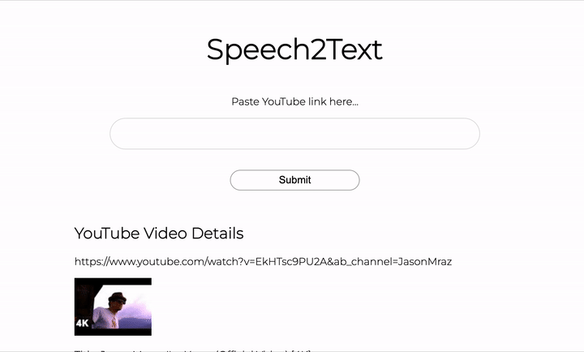

# Youtube To Text
Given a youtube link, this code will extract the audio and run Speech2Text, outputting the transcript.
# Speech-to-Text

This repository makes use of [Speech-to-text](https://github.com/snakers4/silero-models), to extract the transcript from a youtube video. 

## Installation
```
pip install -r requirements.txt
```
## Demo



## Getting Started
```
python3 app.py
```


## Tools Used
[PyTorch Hub](https://pytorch.org/hub/)

[Pafy](https://pypi.org/project/pafy/)

[FFMPEG](https://www.ffmpeg.org/)
